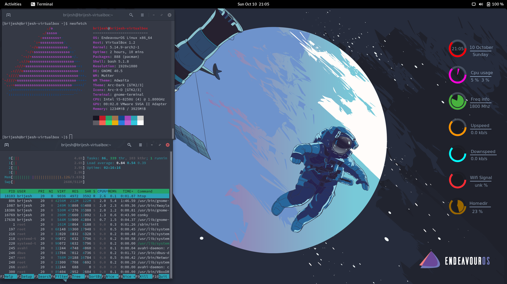

Conky file for my personal Deskop running on Endeavour OS with GNOME desktop environment.

#### Screenshot

#### Steps
1. Install conky and conky-cairo.
2. git clone https://github.com/BrijeshSinghRawat/conky.git
3. cd conky
4. conky -c .conkyrc

